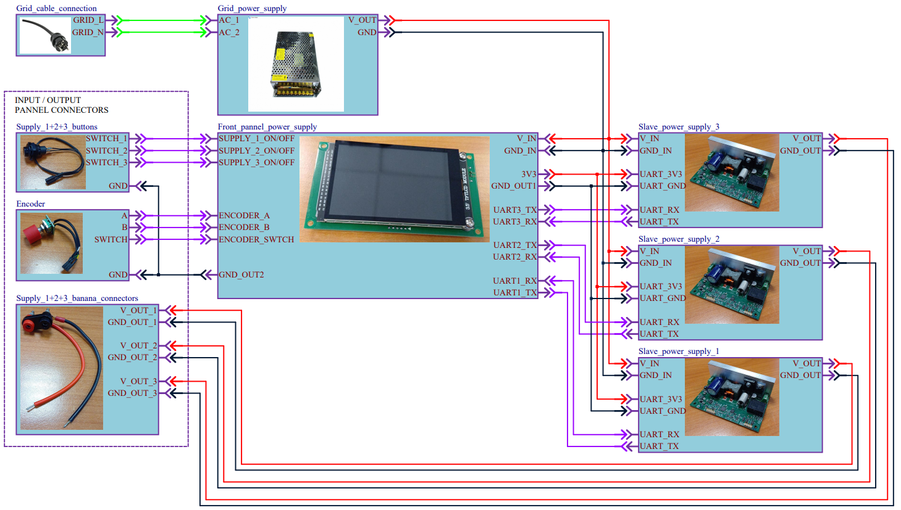

     
    <h1>Front panel power supply with capacitive touchscreen ( in progress )</h1>

<!-- ______________________________________________________________________________________________________________________________________________________ INTRODUCTION -->
# :rocket: Introduction

The power supply front panel with capacitive touchscreen is a personal project focused on designing and developing a hardware and software solution for real-time configuration and monitoring of up to three independent power supplies. 
The system uses a TFT LCD with a capacitive touchscreen to provide an intuitive, user-friendly interface for controlling the power supplies. 
A custom low-level graphics engine was developed to render text, shapes, and images in a non-blocking manner, ensuring smooth and responsive interactions.

To achieve high performance, data is transferred to the LCD using a 16-bit parallel bus, significantly enhancing the rendering speed and overall user interface responsiveness. 
This project combines embedded hardware and software development, emphasizing performance optimization and scalability to create a reliable and efficient control system for power supply management.

A few videos were recoreded to showcase the implemented functionality, and they can be checked out in the [Demo](#fire-demo) section.
Additionally, multiple photos of the project are available there.

<!-- ______________________________________________________________________________________________________________________________________________________ TABLE OF CONTENT -->
# :ledger:Table of content

- [:rocket: Introduction](#rocket-introduction)
- [:ledger:Table of content](#ledgertable-of-content)
- [:page\_facing\_up: About the project](#page_facing_up-about-the-project)
- [:gear: Components](#gear-components)
- [:toolbox: Hardware implementation](#toolbox-hardware-implementation)
- [:computer: Software implementation](#computer-software-implementation)
  - [Menu structure](#menu-structure)
- [:fire: Demo](#fire-demo)

<!-- ______________________________________________________________________________________________________________________________________________________ ABOUT THE PROJECT -->
# :page_facing_up: About the project

The front panel is designed to configure up to three slave power supplies, each with its own serial communication port. 
The slave power supply can function either as a basic power supply or as a battery charger. 
The panel’s functionalities include:
1. changing the operation mode
2. adjusting the end-of-charge current ( EOC ) for a battery
3. turning on / off the channel
4. displaying overcurrent protection
5. adjusting the current and voltage
6. displaying the real-time current and voltage of the channel

The final system consists of several modules to facilitate the development process and enable easy integration of future improvements. 
These modules include:
1. front panel
2. up to 3 slave power supplies
3. grid power supply - provide voltage the slave power supplies
An important aspect of the design is that the modules are isolated from one another.

The fonts and images used in the front panel are converted by a Python script into binary data, which can then be displayed on the LCD using the MCU.

> [!IMPORTANT]
> The front panel was developed by me in collaboration with a work colleague.

<!-- ______________________________________________________________________________________________________________________________________________________ COMPONENTS -->
# :gear: Components

The following list contains the main components needed to build the front panel:
+ main components
    + 1x dsPIC33CK1024MP706 16-bit microcontroller
        + [ Link datasheet dsPIC33CK1024MP706 ]( https://ww1.microchip.com/downloads/en/DeviceDoc/PIC16-L-F18326-18346-Data-Sheet-40001839D.pdf )
    + 1x MRB3511 LCD module, 480x320 TFT
        + [ Link module MRB3511 ]( https://es.aliexpress.com/item/1005005710756860.html?gatewayAdapt=glo2esp )
        + [ Link user manual MRB3511 ]( http://www.lcdwiki.com/res/MRB3511/3.5inch_8&16BIT_Module_MRB3511_User_Manual_EN.pdf )
        + 1x ILI9488 LCD controller
            + [ Link datasheet ILI9488 ]( https://www.hpinfotech.ro/ILI9488.pdf )
        + 1x GT911 capacitive touch controller
            + [ Link datasheet GT911 ]( https://www.fortec-integrated.de/fileadmin/pdf/produkte/Touchcontroller/DDGroup/GT911_Datasheet.pdf)
    + 1x MCP16311 synchronous buck converter 
        + [ Link datasheet MCP16311 ]( https://ww1.microchip.com/downloads/en/DeviceDoc/MCP16311-Family-Data-Sheet-DS20005255C.pdf )
    + multiple buttons and one encoder
+ auxiliary components
    + custom 3D printed parts
    + multiple screws ( 2x M3x8, 4x M3x12 )
    + multiple male and female headers, cables & heat shrink tubes

<!-- ______________________________________________________________________________________________________________________________________________________ HARDWARE IMPLEMENTATION -->
# :toolbox: Hardware implementation

The system's architecture is illustrated below:

**FIGURE: System's architecture**

To represent the connections' functionalities, the following colors were used:

- ${\textsf{\color{green}green}}$  - AC power supply
- ${\textsf{\color{red}red}}$ and black - DC power supply
- ${\textsf{\color{purple}purple}}$ - digital signals

The front panel's PCB was designed to accommodate the LCD's size.

**FIGURE: Front panel, front view**

All components were place on the bottom side, to leave the space between the LCD nad the PCB empty.

**FIGURE: Front panel, back view**

The spacing between the LCD module and the board is minimized by soldering the LCD directly to the PCB. 
This is achieved with 3 custom 3D printed parts, 2 M3 screws, and 2 M3 nuts.

**FIGURE: Front panel, spacers**

**FIGURE: Front panel, bottom view**

<!-- ______________________________________________________________________________________________________________________________________________________ SOFTWARE IMPLEMENTATION -->
# :computer: Software implementation

The software architecture of the system was designed to ensure that the code is non-blocking. 
This design approach significantly enhances the robustness of the device. 
If any component of the system operates outside its established parameters and fails, it will not cause the entire system to halt.

Given that multiple events can occur asynchronously, special attention was given to prevent concurrent access to the same data, ensuring data integrity throughout the system.

<!-- ------------------------------------------------------------------------------------------------------------------------------------------------------ MENU STRUCTURE -->
## Menu structure

The menu is organized into two pages.
The structure of the menu is outlined below:

**FIGURE: Home menu**

**FIGURE: Settings menu**

<!-- ______________________________________________________________________________________________________________________________________________________ DEMO -->
# :fire: Demo

Two boards were used for testing: one slave board and one prototyping board ( programmed with the corresponding serial protocol ).
The telemetry data is randomly generated and transmitted to the front panel.
The demo setup is shown below:

**FIGURE: Demo setup front**

**FIGURE: Demo setup back**

The panel's functionalities can be observed live in the following videos:

> [!CAUTION]
> The videos are uploaded on Drive, and the rendering quality in browser is very low, so for optimal performance, they should be downloaded before viewing.

The video links are listed below:
+ adjust the channel's current and voltage using the encoder ( [ link ]( https://drive.google.com/file/d/1pqEe4l5mKh7kp4SnxlGAQvKRMToewaJV/view?usp=sharing ) )
+ change the channel's configuration ( [ link ]( https://drive.google.com/file/d/1e9ajdeINCtV6y16M1vUfGTdUylY8tROb/view?usp=sharing ) )
+ connect and disconnect a channel during operation ( [ link ]( https://drive.google.com/file/d/1AMagE9lXeZ6VxXe9v7Ppqh8tnr0dTL3n/view?usp=sharing ) )
